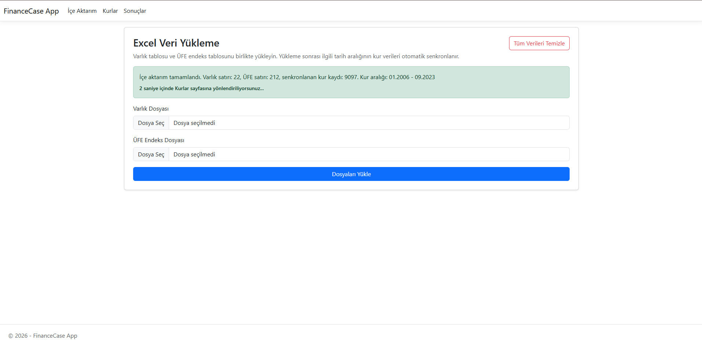

# FinanceCase

FinanceCase is a financial management application built with ASP.NET Core MVC and Web API architecture.

The project includes financial data import, exchange rate synchronization, inflation-based calculations and reporting features. It allows users to upload Excel datasets, automatically synchronize exchange rate data and analyze financial results through tables and charts.

The solution consists of two separate projects:

- `FinanceCase.Web`
- `FinanceCase.Api`

---

# Project Overview

The application follows a financial data processing workflow:

- Exchange rate data is fetched from an external service and stored in SQL Server
- Asset and inflation datasets are imported from Excel files
- Historical exchange rate data is automatically synchronized based on imported date ranges
- Users are redirected to the import screen on first launch
- Exchange rate and result pages remain hidden until data import is completed
- Financial calculations are processed automatically
- Results are displayed through tables and chart-based reports

Hangfire is used for scheduled background synchronization of exchange rate data.

---

# Key Features

- Excel-based asset and inflation data import
- Automatic exchange rate synchronization
- Financial calculation and reporting system
- Dollarization and inflationization calculations
- Hangfire background jobs for scheduled updates
- Chart and table-based result visualization
- Pagination support for exchange rate records
- Responsive dashboard interfaces
- REST API endpoint for exchange rate data
- User-friendly error handling for invalid file uploads
- Automatic page redirection and onboarding flow

---

# Screenshots

## Data Import Screen


## Successful Upload & Redirect



## Exchange Rate Records


## Results Chart


## Results Table


---

# Technologies Used

## Backend
- ASP.NET Core MVC
- ASP.NET Core Web API
- Entity Framework Core
- REST API
- Hangfire
- NPOI

## Database
- SQL Server / SQLEXPRESS

## Frontend
- HTML5
- CSS3
- JavaScript
- Chart.js

## Tools
- .NET 10
- Git
- GitHub

---

# Application Flow

1. User uploads asset and inflation Excel files
2. Imported date ranges are analyzed
3. Historical exchange rate data is automatically synchronized
4. Financial calculations are processed
5. Results are displayed through charts and tables
6. Hangfire periodically updates exchange rate records in the background

---

# Data Sources

- Exchange Rate API  
  `https://testapi.finmaks.com/ExchangeRates?key=Finmaks123`

- Asset Data  
  `.xls` / `.xlsx`

- Inflation Data  
  `.xls` / `.xlsx`

> Note: The original case documentation referenced XML imports, but the provided sample datasets were Excel files. Therefore, the import system was implemented using Excel-based processing.

---

# Implemented Features

- Exchange rate synchronization and MSSQL persistence
- Hourly background updates using Hangfire
- Excel import for asset and inflation datasets
- Automatic historical exchange rate synchronization
- Import-first onboarding workflow
- Automatic navigation after successful data import
- Dynamic menu visibility based on application state
- Development-only data cleanup functionality
- User-friendly validation and error messages
- Financial calculation engine
- Chart and table-based reporting
- AJAX-based result screen updates
- Separate API project for exchange rate endpoints
- Pagination support for exchange rate records

---

# Installation

## 1. SQL Server Setup

Make sure SQL Server or SQLEXPRESS is installed and running.

---

## 2. Restore Packages

```bash
dotnet restore FinanceCase.slnx
```

---

## 3. Apply Database Migrations

```bash
dotnet ef database update --project FinanceCase.Web
```

---

## 4. Run the Web Application

```bash
dotnet run --project FinanceCase.Web
```

---

## 5. Initial Data Import

When the application starts, users are redirected to the import page.

After uploading asset and inflation Excel files:

- Exchange rate data is automatically synchronized
- Financial calculations are processed
- Users are redirected to the exchange rates page

---

## 6. Run the API Project

```bash
dotnet run --project FinanceCase.Api
```

---

# Sample Files

Example Excel files are available under:

```text
FinanceCase.Web/SampleFiles/
```

These files can be used for testing purposes.

---

# Future Improvements

- Authentication and authorization system
- Docker support
- Exportable PDF/Excel reports
- Advanced filtering and analytics
- Unit and integration testing
- Role-based admin management

---

# Developer

Anıl Hasan Ateş

- LinkedIn: https://linkedin.com/in/anilates97
- GitHub: https://github.com/anilates97
- Portfolio: https://anilates.vercel.app/
