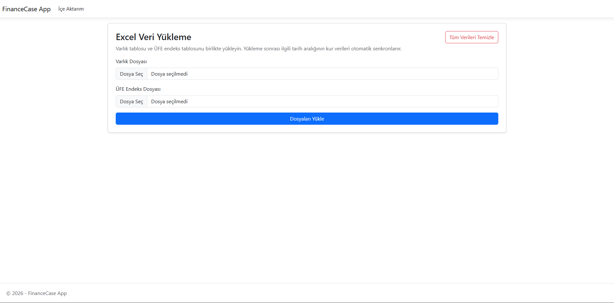
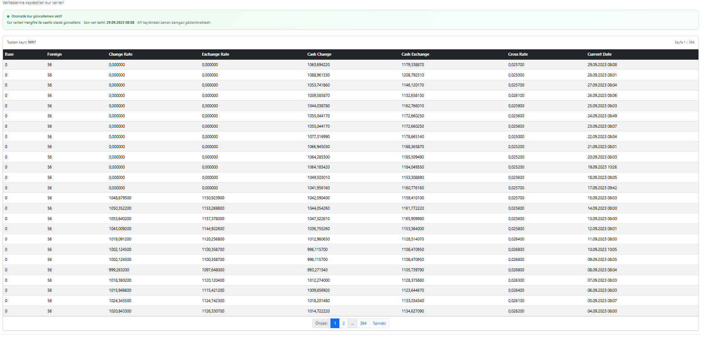
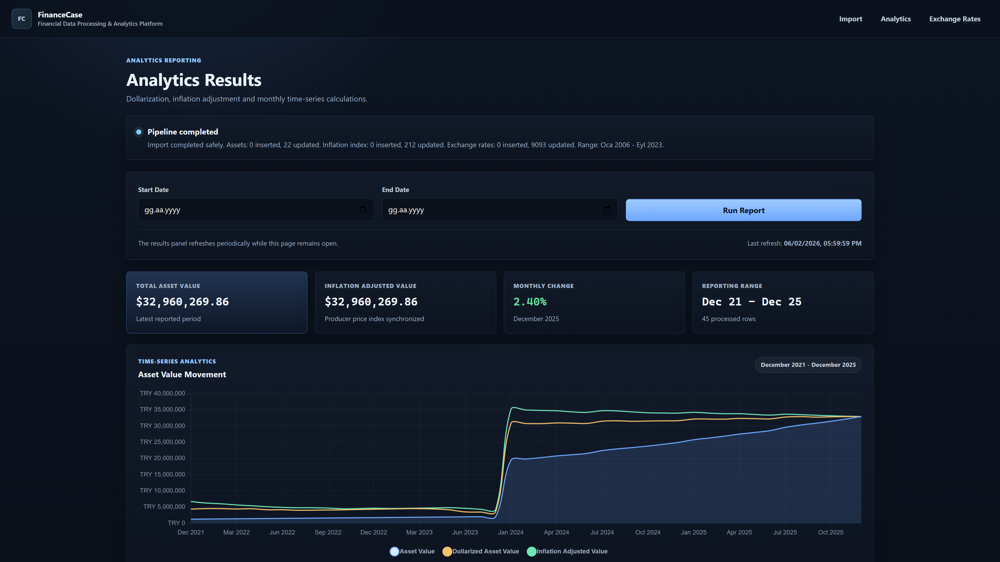
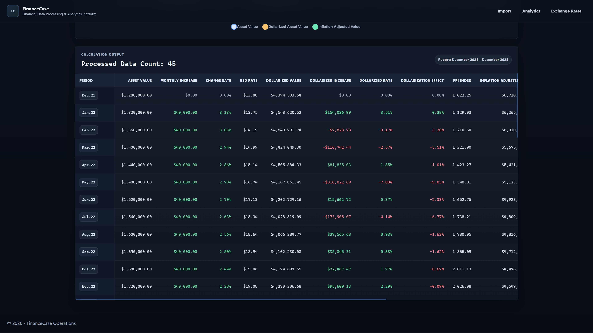

# FinanceCase

FinanceCase is a backend-focused financial reporting case project built with ASP.NET Core MVC, Web API, Entity Framework Core, SQL Server, Hangfire, and NPOI.

It imports asset and inflation datasets from Excel files, synchronizes exchange-rate data from an external API, stores normalized financial records in SQL Server, and generates dollarization/inflation-based report results through an MVC dashboard.

---

## Why I Built This

This project was developed as a financial case study where the main challenge was not only displaying data, but building a reliable data-processing flow.

The application needed to handle Excel imports, historical exchange-rate synchronization, duplicate records, missing monthly data, and calculation rules based on both inflation index values and USD exchange rates.

---

## Main Features

- Excel import for asset and inflation index datasets
- `.xls` and `.xlsx` support with NPOI
- Turkish culture-aware date and decimal parsing
- Import validation and user-friendly error handling
- Transaction-safe import process
- Upsert logic for existing monthly records
- External exchange-rate API integration
- Historical exchange-rate synchronization based on imported date ranges
- Hourly exchange-rate updates with Hangfire
- SQL Server persistence with Entity Framework Core
- Financial calculations based on asset amount, USD rate, and inflation index
- Chart and table-based reporting interface
- Separate Web API project for current exchange-rate data

---

## Screenshots

### Data Import



### Exchange Rate Records



### Results Chart



### Results Table



---

## Tech Stack

**Backend**

- ASP.NET Core MVC
- ASP.NET Core Web API
- C#
- Entity Framework Core
- SQL Server
- Hangfire
- NPOI
- HttpClient

**Frontend**

- Razor Views
- HTML
- CSS
- JavaScript
- Chart.js

**Tools**

- .NET 10
- Git
- GitHub

---

## Project Structure

```text
FinanceCase
├── FinanceCase.Web
│   ├── Controllers
│   ├── Data
│   ├── Dtos
│   ├── Models
│   ├── Services
│   ├── ViewModels
│   ├── Views
│   └── SampleFiles
│
└── FinanceCase.Api
    └── Controllers
```

`FinanceCase.Web` contains the main MVC application, import flow, calculation logic, reporting screens, background jobs, and database access.

`FinanceCase.Api` exposes the latest available exchange-rate records through a lightweight REST endpoint.

---

## How the Application Works

The application starts with the import screen. Users upload asset and inflation index Excel files. After validation, the records are normalized by monthly period and saved to SQL Server.

During the same flow, the application synchronizes exchange-rate data for the imported date range. This makes the reporting screen work with matching asset, inflation, and exchange-rate records.

The calculation logic only includes months where both inflation index data and USD exchange-rate data exist. This prevents incomplete periods from producing misleading financial results.

---

## API Endpoint

The API project exposes the latest available exchange-rate records:

```http
GET /api/exchangerates/current
```

If there is no exchange-rate data, the endpoint returns `404`.

---

## Installation

### Clone the repository

```bash
git clone https://github.com/anilates97/FinanceCase.git
cd FinanceCase
```

### Restore packages

```bash
dotnet restore FinanceCase.slnx
```

### Configure SQL Server

Update the connection string in `appsettings.json`:

```json
{
  "ConnectionStrings": {
    "DefaultConnection": "Server=.;Database=FinanceCaseDb;Trusted_Connection=True;TrustServerCertificate=True;"
  }
}
```

### Configure exchange-rate API key

```json
{
  "FinanceCase": {
    "ExchangeRateApiKey": "YOUR_API_KEY",
    "EnableHangfireDashboard": true
  }
}
```

### Apply migrations

```bash
dotnet ef database update --project FinanceCase.Web
```

### Run the MVC application

```bash
dotnet run --project FinanceCase.Web
```

### Run the API project

```bash
dotnet run --project FinanceCase.Api
```

---

## Sample Files

Sample Excel files are included under:

```text
FinanceCase.Web/SampleFiles/
```

They can be used to test the import flow.

---

## Technical Notes

- Imports are processed inside a database transaction to avoid partial writes.
- Asset and inflation records are normalized by monthly period.
- Existing records are updated instead of blindly duplicated.
- Exchange-rate records use a unique key based on base currency, foreign currency, and date.
- Monthly calculations use the latest available USD rate within each month.
- Report periods are limited to months that have both exchange-rate and inflation data.

---

## Developer

**Anıl Hasan Ateş**

- LinkedIn: https://linkedin.com/in/anilates97
- GitHub: https://github.com/anilates97
- Portfolio: https://anilates.vercel.app/
